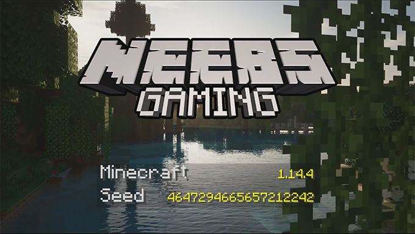

# Mods used in Neebs Gaming's Minecraft series

A list of mods used in the Neebs Gaming 2019 Minecraft series

---

## World Info

- **Minecraft version:** `1.14.4`

- **World seed:** `4647294665657212242`

## Mods

- **Fabric API** - [Download](https://fabricmc.net/use/) - [Documentation](https://fabricmc.net/wiki/install) - [Website](https://fabricmc.net)

- **Optifine** - [Download](https://optifine.net/downloads) - [Documentation](https://github.com/sp614x/optifine/tree/master/OptiFineDoc/doc) - [Website](https://optifine.net/home)

- **Optifabric** - [CurseForge](https://www.curseforge.com/minecraft/mc-mods/optifabric) - [Github](https://github.com/modmuss50/OptiFabric)

- **The Biome Overhaul** - [CurseForge](https://www.curseforge.com/minecraft/mc-mods/the-biome-overhaul) - [Github](https://github.com/valoeghese/TheBiomeOverhaul)

- **ReplayMod (*optional*)** - [Download](https://www.replaymod.com/download/) - [Documentation](https://www.replaymod.com/docs/) - [Website](https://www.replaymod.com/)

## Shader

- **SEUS (Sonic Ether’s Unbelievable Shaders)** - [Website](https://sonicether.com/seus/) 

**SEUS PTGI** is a paid mod available through the developer Patreon

A free version named **SEUS Renewed** is availabe [here](https://sonicether.com/seus/#Downloads), though it may not work as well, I can't say for sure as I haven't tested it yet.

## Resource/Texture Pack

- **Vanilla PBR** - [CurseForge](https://www.curseforge.com/minecraft/texture-packs/vanilla-pbr) 

## Contributing

If you notice something wrong or spot something I missed feel free to submit an issue or open a pull request.
